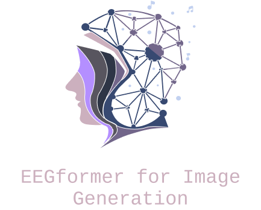
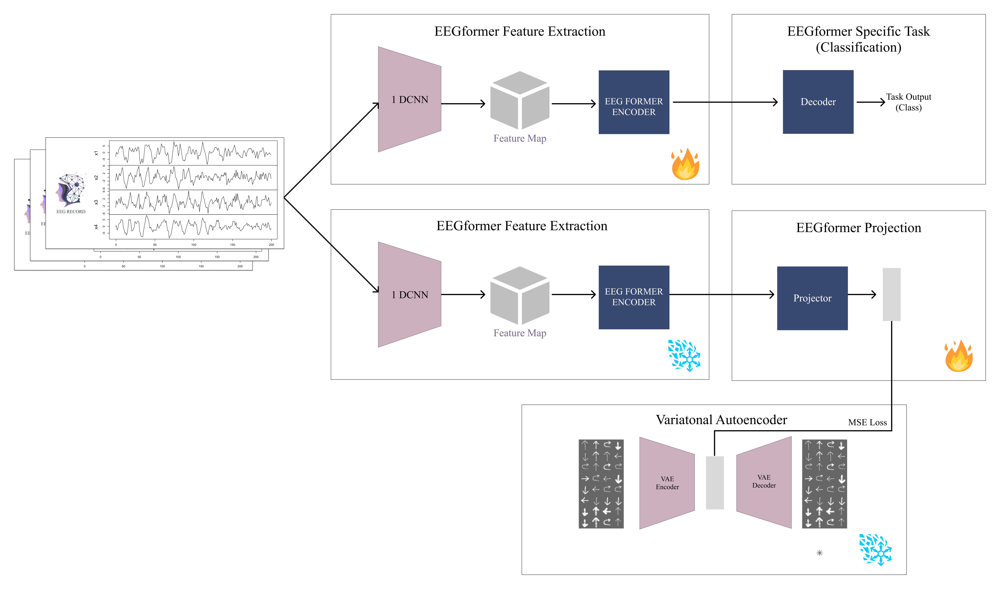
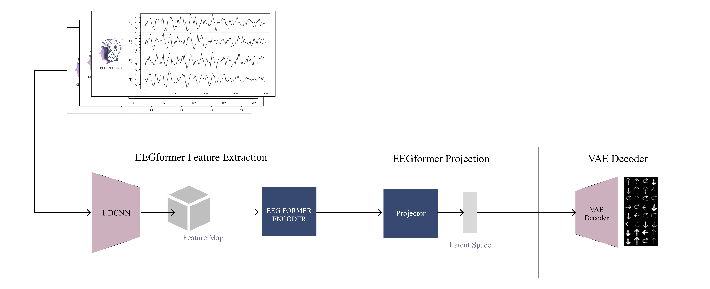
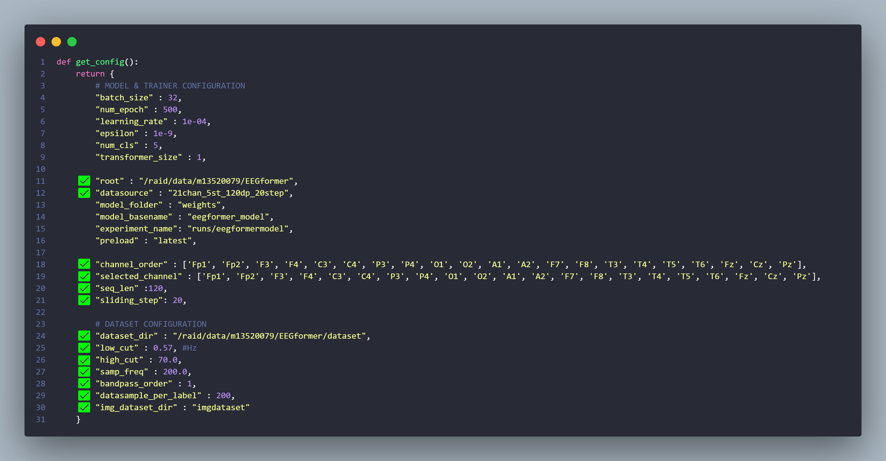

<div align="center">

</div>

<br/>
<br/>

<div align="center">
    <strong>
        Image Generation using Brain Wave Activity (Electroencephalogram) Motor Imagery Case using Autoencoder and Transformer Based Model.
    </strong>
    Specifically, EEGformer and Variatonal Autoencoder (VAE)
<br />
<br />

</div>

<div align="center">


[](https://www.npmjs.com/package/@refinedev/core)
[](https://www.npmjs.com/package/@refinedev/core)
[](https://www.npmjs.com/package/@refinedev/core)

[](https://www.instagram.com/ghebyon_ngl/)
[](https://www.linkedin.com/in/ghebyonnainggolan/)

</div>
<br/>
<div align="center">
    <h2>Proposed Framework</h2>
    
    <h3>Image Generation (Pipeline)</h3>
    
</div>

<br/>

## What is Electroencephalogram?

**Electroencephalogram (EEG)** is one of the sensors commonly used in the medical field. EEG sensors are used by recording human brain waves to measure biometric data. This biometric data will then be decoded to understand the physical and psychological conditions or status of the subject underlying the EEG signal. The basic principle of the EEG sensor is to detect electrical activity that occurs in the human brain (subject).

## ⚡ Understand Directory Structure

### Directory Structure
```
EEGformer/
├── 📘docs/
├── 🛢️dataset/
├── 🛢️imgdataset/
│
├── 📁database/
│   ├── 📁 database1/
│   ├── 📁 database1_weight/
│   ...
│   ├── 📁 databaseN/
│   └── 📁 databaseN_weight/
│
├── 📁util/
│   ├── 📃config.py
│   └── 📃generate_MI_database.py
│
├── 📃EEGImageDataset.py
├── 📃EEGDataset.py                   # deprecated
├── 📃model.py                        # EEGformer for classification
├── 📃model_vae.py                    # VAE for Image generation
├── 📃trainer_classification.py       # Trainer for EEGformer classifications
├── 📃trainer_vae.py                  # Trainer for VAE image generation
├── 📃trainer_class_vae.py            # Trainer/Pipline for EEG Image Generation
└── 📃train.py                        # deprecated
```


## PREPARATION

### Dataset Preparation

- Download the **IMAGE DATASET**. This dataset already provided by this repository in imgdataset
- Download the **EEG DATASET** first. Check <a href="./dataset/README.MD">README DATASET</a>. All of the dataset is in .mat files<br>
Or u can check the <a href="./database/README.MD">README DATABASE</a> to download the preprocessed data. (No need to Generate Processed Dataset. You can skip the next step)

### Processing Dataset & Generate Processed Dataset
- Check the <a href="./util/config.py">Configuration File</a>
- Update the configuration. You can update the checked list value/field
    <div align="center">
        
    </div>
- Now you can run file ```generate_MI_dataset.py```. <br>*Be aware I'm not consider the efficiency of memory when run this file. But it works in My University server.*
- Check the ```./database``` folder. There must be a new database folder named same with ```config["datasource"]```. And it contains 4 folders(1 files) + 2 files : 
    - eegtrain / eeg_data.npy
    - eegtest / eeg_data.npy
    - imgtrain / imgeeg.npy
    - imgtest / imgeeg.npy
    - labeleeg_train.npy
    - labeleeg_test.npy


## LET'S GET STARTED

### 1. Configuration

Here is the configuration file (found at <a href="./util/config.py">./util/config.py</a>). It is used for the entire code, so please check it carefully when you want to run the training.

**GLOBAL CONFIGURATION**
```python
def get_config():
    return {
        # MODEL & TRAINER CONFIGURATION
        "batch_size" : 32,
        "num_epoch" : 500,      # deprecated
        "learning_rate" : 1e-04,
        "epsilon" : 1e-9,
        "num_cls" : 5,
        "transformer_size" : 1,

        "root" : "/raid/data/m13520079/EEGformer",
        "datasource" : "21chan_5st_120dp_20step",
        "model_folder" : "weights",
        "model_basename" : "eegformer_model",
        "experiment_name": "runs/eegformermodel",
        "preload" : "latest",

        "channel_order" : ['Fp1', 'Fp2', 'F3', 'F4', 'C3', 'C4', 'P3', 'P4', 'O1', 'O2', 'A1', 'A2', 'F7', 'F8', 'T3', 'T4', 'T5', 'T6', 'Fz', 'Cz', 'Pz'],        
        "selected_channel" : ['Fp1', 'Fp2', 'F3', 'F4', 'C3', 'C4', 'P3', 'P4', 'O1', 'O2', 'A1', 'A2', 'F7', 'F8', 'T3', 'T4', 'T5', 'T6', 'Fz', 'Cz', 'Pz'],
        "seq_len" :120,
        "sliding_step": 20,

        # DATASET CONFIGURATION
        "dataset_dir" : "/raid/data/m13520079/EEGformer/dataset",
        "low_cut" : 0.57, # Hz
        "high_cut" : 70.0, # Hz
        "samp_freq" : 200.0,
        "bandpass_order" : 1,
        "datasample_per_label" : 200,
        "img_dataset_dir" : "imgdataset"
    }
```

**Image Generation Configuration (trainer_class_vae.py)**
```python
local_config_vae = {
    "vae_model_folder" : "./database_vae/vae_weights",
    "vae_model_basename" : "vaemodel",
    "experiment_name" : "./database_vae/runs/vaemodel",
    "result_folder" : "./database_vae/results",
    "preload" : "latest" # or number that represent the epoch
}
local_config_gen = {
    "proj_model_folder" : "./database_proj/21chan_5st_120dp_20step/proj_weights",
    "proj_model_basename" : "projmodel",
    "experiment_name" : "./database_proj/21chan_5st_120dp_20step/runs/projmodel",
    "result_folder" : "./database_proj/21chan_5st_120dp_20step/results",
    "preload" : "latest" # or number that represent the epoch
}
```
**VAE Configuration (trainer_vae.py)**
```python
local_config = {
    "vae_model_folder" : "./database_vae/vae_weights",
    "vae_model_basename" : "vaemodel",
    "experiment_name" : "./database_vae/runs/vaemodel",
    "result_folder" : "./database_vae/results"
}
```
**Description for every key in GLOBAL CONFIGURATION**

| **Key**               | **Description**                                               |
|-----------------------|---------------------------------------------------------------|
| **batch_size**        | Number of batch size for training. For safety use 32 only                             |
| **num_epoch**         | *Deprecated!* Number of epochs                                |
| **learning_rate**     | Learning rate for training optimizer                          |
| **epsilon**           | Epsilon for training optimizer                                |
| **num_cls**           | Number of class to classify                                   |
| **transformer_size**  | Size of the transformer in EEGformer                          |
| **root**              | Path of the project                                           |
| **datasource**        | Datasource/Database that model working on (Folder in ./database)|
| **model_folder**      | suffix for saved **Model folder**. For exported model             |
| **model_basename**    | prefix for save **Model file** in **Model folder**                    |
| **experiment_name**   | Experiment name, logging folder from Tensorboard              |
| **preload**           | The EEGformer model that will loaded. Currently only provide latest|
| **channel_order**     | Default Channel Order from SCPMI Dataset. *DO NOT CHANGE THIS!*|
| **selected_channel**  | Selected Channel for model dan generated dataset(Order Sensitive)|
| **seq_len**           | Sequence Length (Temporal length). Currently model only work with 120 data points|
| **sliding_step**      | Number of step for sliding window                             |
| **dataset_dir**       | Path of the EEG dataset. "/_root_/dataset"                    |
| **low_cut**           | Bandpass filter low cut (default 0.57)                        |
| **high_cut**          | Bandpass filter high cut (default 70)                         |
| **samp_freq**         | Sampling frequency (200Hz by default)         |
| **bandpass_order**    | Order for Bandpass. Type : Integer filtering                                  |
| **datasample_per_label** | *Deprecated!* Same with samp_freq                          |
| **img_dataset_dir**   | Number of class to classify                                   |


### 2. EEGformer Training


Command to run training
```
CUDA_VISIBLE_DEVICES=<list_of_gpu_id> torchrun --standalone --nproc_per_node=gpu trainer_classification.py <number_of_epochs> <save_state_every>
```

For example :
```
CUDA_VISIBLE_DEVICES=0,1,2,3 torchrun --standalone --nproc_per_node=gpu trainer_classification.py 200 1
```

### 3. VAE Training

Command to run training
```
CUDA_VISIBLE_DEVICES=<list_of_gpu_id> torchrun --standalone --nproc_per_node=gpu trainer_vae.py <number_of_epochs> <save_state_every>
```

For example :
```
CUDA_VISIBLE_DEVICES=0,1,2,3 torchrun --standalone --nproc_per_node=gpu trainer_vae.py 200 1
```

### 4. Training/Pipeline of Image Generation using EEG

Command to run training
```
CUDA_VISIBLE_DEVICES=<list_of_gpu_id> torchrun --standalone --nproc_per_node=gpu trainer_class_vae.py <number_of_epochs> <save_state_every>
```

For example :
```
CUDA_VISIBLE_DEVICES=0,1,2,3 torchrun --standalone --nproc_per_node=gpu trainer_class_vae.py 200 1
```


## Results

...

## License

Licensed under the MIT License, Copyright © 2024-Ghebyon Tohada Nainggolan
